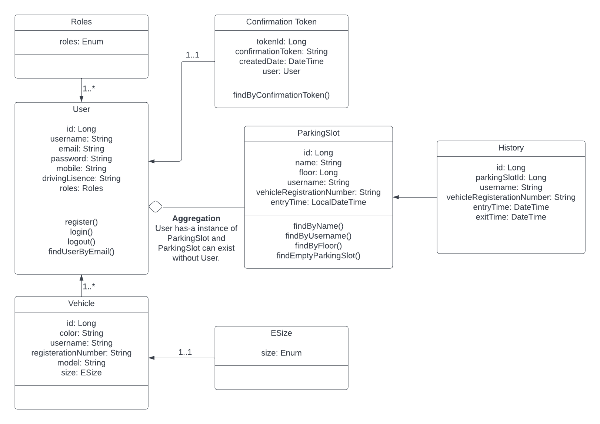

# spring-boot-parking-system

# Parking System Backend

### Class Diagram



### User Authentication

- SignUp: http://localhost:8080/api/auth/signup
  ```
  "username":"test2",
  "email":"test2@gmail.com",
  "password":"12345678",
  "mobile":"1234567890",
  "drivingLisence":"GJ12345",
  "role":["user"]
- SignIn: http://localhost:8080/api/auth/signin
  ```
  "username":"test2",
  "password":"12345678"
- SignOut: http://localhost:8080/api/auth/signout
- Details of user: http://localhost:8080/api/auth/details/test2
- Insert into roles tables
  ```
    INSERT INTO roles(name) VALUES('ROLE_USER');
    INSERT INTO roles(name) VALUES('ROLE_MODERATOR');
    INSERT INTO roles(name) VALUES('ROLE_ADMIN');
- Email verification with Gmail SMTP server

### Vehicle

- Add: http://localhost:8080/api/vehicle/add
  ```
  "color":"red",
  "username":"test2",
  "registerationNumber":"GJ26M2020",
  "model":"Activa 5G",
  "size":"SIZE_SMALL"
- Search by username: http://localhost:8080/api/vehicle/user/test
- Search by Registration Number: http://localhost:8080/api/vehicle/regnum/GJ26M2018

### Parking

- Add: http://localhost:8080/api/parking/add
  ```
  "name":"A104",
  "floor":"1",
  "username":null,
  "vehicleRegisterationNumber":null,
  "size":"SIZE_MEDIUM"
- Park: http://localhost:8080/api/parking/park (here id is parkingSlotId)
   ```
    "id": 1,
    "floor":"1",
    "username":"test",
    "vehicleRegisterationNumber":"GJ26M2014"
- Unpark: http://localhost:8080/api/parking/unpark/{userId}
- List of Empty parking slots: http://localhost:8080/api/parking/empty
- Find parking slot by name: http://localhost:8080/api/parking/name/A101
- Find parking slot by floor: http://localhost:8080/api/parking/floor/1
